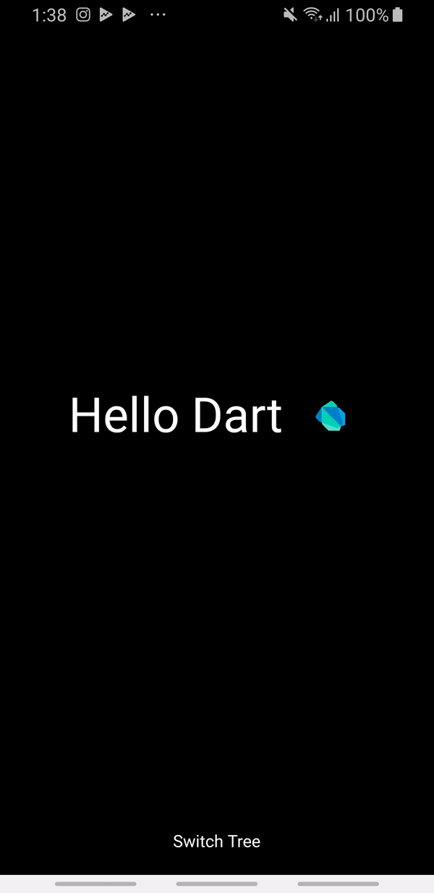

# Flutter Preformance Demo

This source code is used for reference in the "How Flutter Apps achieve great performance" workshop. The purpose is to demonstrate how flutter render it is a widget 

# Demo 

# Getting Started
1. [Fork repository](https://github.com/sayed3li97/FlutterClock-Challenge-BH/fork) or clone and download the repository 
1. Install [Latest Flutter version](https://flutter.dev/docs/get-started/install)
1. Install [Android Studio / IntelliJ / VSCode](https://flutter.dev/docs/development/tools/android-studio)
1. Run the command `flutter pub get`
1. Run the command `flutter run`
